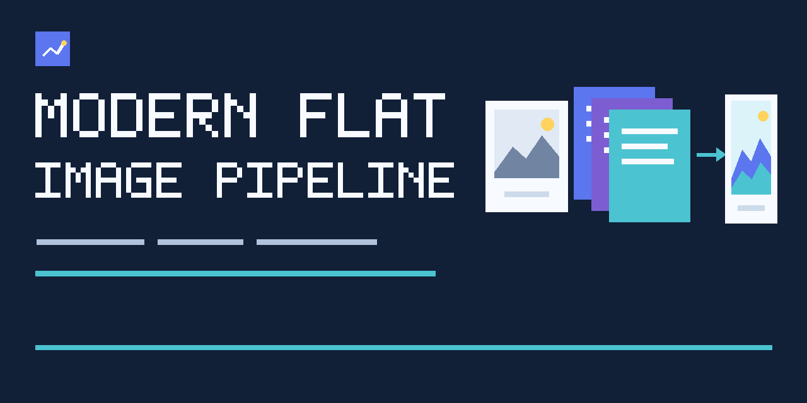

# Modern Flat Image Pipeline



A generator-independent Agent Skill that turns one or more visual references into a new **Modern Flat illustration** through structured analysis, explicit locks, a generator-neutral scene contract, visual QA, and targeted correction.

```text
plugin 0.1.0 · skill 0.1.0 · style 0.1.0 · prompt pack 0.1.0 · evaluation 0.1.0
```

```text
Use $modern-flat-image-pipeline to analyze the attached reference, preserve the required meaning and composition, create a new Modern Flat illustration, inspect the actual result, correct diagnosed defects, and show the accepted final image.
```

## Why this exists

A reference image mixes subject, identity, action, camera, composition, palette, incidental detail, and rendering style. Sending all of it directly to a generator creates uncontrolled averaging and style drift.

This skill separates those concerns before generation and verifies the **actual returned image**, not only the prompt.

## Pipeline

```text
reference input
-> input gate
-> reference analysis
-> reference roles
-> semantic / identity / composition locks
-> Scene Brief
-> Modern Flat style contract
-> Generation Specification
-> pre-generation gate
-> image generation or edit
-> visual QA
-> targeted correction or regeneration
-> final user-visible delivery
```

## Use this skill for

- reference-to-image reinterpretation in Modern Flat;
- composition-guided generation;
- object, product, machine, or architecture restyling with an Identity Lock;
- multiple references with explicit roles;
- staged construction of a complex scene;
- diagnosis and correction of an existing Modern Flat candidate.

Do not use it when the intended final style is photorealistic, painterly, anime-led, generic flat minimalism without dimensional depth, glossy 3D CGI, or direct imitation of a named living artist.

## Install as a standalone skill

```bash
git clone https://github.com/sevranty/modern-flat-image-pipeline.git "$HOME/modern-flat-image-pipeline"
mkdir -p "$HOME/.codex/skills"
ln -sfn "$HOME/modern-flat-image-pipeline/skills/modern-flat-image-pipeline" "$HOME/.codex/skills/modern-flat-image-pipeline"
```

Restart the host if it does not discover newly added skills automatically.

## Codex plugin package

The repository is also packaged with `.codex-plugin/plugin.json`.

```bash
mkdir -p "$HOME/plugins"
git clone https://github.com/sevranty/modern-flat-image-pipeline.git "$HOME/plugins/modern-flat-image-pipeline"
```

Add that local package to the selected personal or team plugin marketplace using current Codex plugin configuration. The repository does not modify marketplace settings automatically.

## Quick start

### One reference

```text
Use $modern-flat-image-pipeline to preserve the main object, action, camera angle, and large composition masses. Rebuild the rendering in Modern Flat, inspect the result, correct diagnosed errors, and show the accepted image.
```

### Multiple references

```text
Use $modern-flat-image-pipeline. Treat reference 1 as object identity, reference 2 as composition, and reference 3 as environment. Do not inherit their rendering styles. Create and inspect one coherent Modern Flat scene.
```

### Correct an existing candidate

```text
Use $modern-flat-image-pipeline to inspect this candidate against the Scene Brief and Modern Flat contract. Preserve accepted layers, correct one primary diagnostic category, re-inspect the full image, and deliver only the accepted final version.
```

## Transformation modes

| Mode | Preserve | Change |
|---|---|---|
| Semantic reinterpretation | meaning, primary subject, required action | rendering language and incidental detail |
| Composition-guided generation | major masses, camera, negative space | subjects or environment allowed by the brief |
| Identity-preserving restyle | observable identity or construction features | surfaces, color treatment, light, depth |
| Multi-reference synthesis | explicitly assigned role from each reference | conflicting or unassigned properties |
| Targeted correction | accepted layers of an existing candidate | one diagnosed defect family |

The user reference never owns output style. The internal Modern Flat Style Lock is mandatory and non-overridable.

## Runtime artifacts

| Artifact | Purpose |
|---|---|
| Reference Analysis Card | separates observed evidence, inference, and unknowns |
| Reference Map | assigns content, identity, pose, construction, camera, composition, scale, environment, palette direction, or detail roles |
| Locks | defines what generation cannot change |
| Scene Brief | states purpose, message, subject, action, environment, depth, and success criteria |
| Composition Specification | fixes camera, framing, negative space, safe area, and crop protection |
| Generation Specification | canonical source of truth for one attempt |
| QA report | records weighted scores, critical defects, diagnostic category, and next action |
| Delivery record | proves that the accepted candidate is visible to the user |

The natural-language generation prompt is a compiled output, not the canonical contract.

## Modern Flat contract

A valid result uses:

- clean planar or vector-like geometry;
- readable silhouettes;
- dimensional gradient modeling;
- one coherent directional key light;
- controlled rim light where useful;
- clean cast and contact shadows;
- foreground, midground, and background separation;
- atmospheric depth;
- hierarchical detail;
- an explicitly non-photorealistic finish.

See the full [style contract](skills/modern-flat-image-pipeline/references/style-spec.md).

## Quality gates

```text
input gate
-> pre-generation gate
-> visual QA gate
-> final delivery gate
```

A candidate cannot pass by score alone when it contains a critical defect such as wrong subject, lost meaning, broken anatomy, impossible construction, dominant photorealism, dominant glossy CGI, generic flat output without depth, conflicting light directions, critical crop, or missing user-visible delivery.

Correction order:

```text
meaning
-> identity and construction
-> composition and camera
-> silhouette and anatomy
-> geometry and depth
-> light and shadows
-> gradients and palette
-> detail and technical finish
-> delivery
```

See [quality gates](skills/modern-flat-image-pipeline/references/quality-gates.md) and [delivery contract](skills/modern-flat-image-pipeline/references/output-delivery.md).

## Generator capability boundaries

The skill does not bundle an image model or private generation endpoint. It adapts the Generation Specification to capabilities available in the host environment.

Support for reference editing, multiple images, masks, transparent backgrounds, deterministic seeds, exact pixel dimensions, and output formats must be confirmed. Missing capabilities are reported, never invented.

Verified and unavailable routes are tracked in the [adapter profile registry](skills/modern-flat-image-pipeline/assets/adapters/capability-profiles.yaml). The v0.1.0 verified route is the no-image-tool fallback; host-dependent image tools remain unavailable until dated capability evidence exists.

See [generator adapters](skills/modern-flat-image-pipeline/references/generator-adapters.md) and [adapter profile rules](skills/modern-flat-image-pipeline/assets/adapters/README.md).

## Evaluation

Evaluation version `0.1.0` contains twelve end-to-end cases covering photo and illustration reinterpretation, multiple reference roles, sketch-driven composition, people and privacy checks, machine construction, text safe areas, vertical adaptation, style drift, and missing final delivery.

The golden set contains six accepted and six rejected normative anchor specifications. [Evidence state](skills/modern-flat-image-pipeline/assets/anchors/evidence.yaml) is recorded for every anchor. All v0.1.0 visual candidates are explicitly unavailable until a provenance-controlled, rights-cleared generator run and completed QA are published. Unavailable records are accounting, not visual proof.

See [evaluation contract](docs/evaluation-contract.md), [test cases](tests/cases/e2e-cases.yaml), and [anchor rules](skills/modern-flat-image-pipeline/assets/anchors/README.md).

## Local validation

Validators require Python 3 and PyYAML and make no network requests.

```bash
python3 -m pip install -r requirements-validation.txt
python3 scripts/validate_repository.py .
```

The command validates plugin and skill metadata, links, names, versions, ASCII paths, secrets, local paths, evaluation contracts, anchor evidence, adapter evidence, Scene Specifications, prompts, and deterministic positive and negative fixtures.

Static validation does not replace visual inspection of an actual generated image.

## Project governance

MFP is the source of truth for runtime, contracts, assets, tests, validators, local Issues and pull requests, tags, and releases. WebFactoryOS may own only external registry, routing, relations, naming, and orchestration status. It receives no write access and is not a build, runtime, validation, packaging, or release dependency.

See [orchestration boundary](docs/web-factory-os-orchestration.md), [architecture](docs/architecture.md), [agent instructions](AGENTS.md), and [decision log](docs/decision-log.md).

## Repository structure

```text
modern-flat-image-pipeline/
|-- .codex-plugin/plugin.json
|-- skills/modern-flat-image-pipeline/
|   |-- SKILL.md
|   |-- agents/openai.yaml
|   |-- references/
|   `-- assets/
|       |-- templates/
|       |-- anchors/
|       `-- adapters/
|-- scripts/
|-- tests/
|-- assets/
`-- docs/
```

## Known limitations

- Image quality depends on the active generator or editor.
- Exact likeness and strict local edits are not guaranteed without reference-edit capabilities.
- Provenance-controlled visual anchor images are not yet published; all twelve evidence records state why and how to unblock publication.
- The repository social preview asset is committed and owner-confirmed as uploaded through repository Settings with public-card verification for v0.1.0; future repository Settings changes remain owner-side UI actions.
- The project has no automated image-similarity scorer and intentionally requires human or multimodal visual QA.

## Versioning

Runtime skill, style contract, prompt pack, evaluation set, and plugin package versions advance independently. A release must declare all five.

See [versioning](docs/style-versioning.md) and [changelog](CHANGELOG.md).

## Roadmap

- publish provenance-controlled visual candidates when verified generator runs and rights records exist;
- add generator-specific profiles only when current capability contracts are verified;
- consider optional local rendering helpers only after adapter evidence exists and without coupling core runtime to one model;
- expand regression coverage only when a new reproducible failure family is observed.

## Contributing

1. Work in one task branch and one pull request.
2. Keep each detailed rule in one canonical source file.
3. Update the decision log for foundational changes.
4. Update versions and changelog when behavior changes.
5. Run `python3 scripts/validate_repository.py .` before review.
6. Do not commit external references without clear redistribution rights.

## License

MIT. See [LICENSE](LICENSE).
